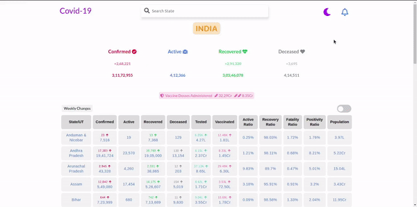

## Covid-19 Tracker <a href="https://brave-mcnulty-9912d2.netlify.app/" target="_blank">[Live]</a>

### Overview
COVID 19 Tracker Web Application for important stats like Confirmed, Active, Recovered, Deceased and Vaccinated cases for all Indian States and Cities with delta change toggle on weekly or daily basis and Notification update for new Covid related information. (Light and Dark mode) 

Project built mainly to learn React, React-Router and Redux. React-router for routing to State’s statistics, Redux-thunk as a middleware and complete project built on React.

### DEMO:
&nbsp;&nbsp;&nbsp;&nbsp; 

### Instructions to Run
This project was bootstrapped with [Create React App](https://github.com/facebook/create-react-app).
In the project directory, you can run:
#### `npm start`

Runs the app in the development mode.\
Open [http://localhost:3000](http://localhost:3000) to view it in the browser.

### APIs Used
1. https://api.covid19india.org/updatelog/log.json - to get the Latest Updates.
2. https://api.covid19india.org/v4/min/data.min.json - to get Covid Data.
